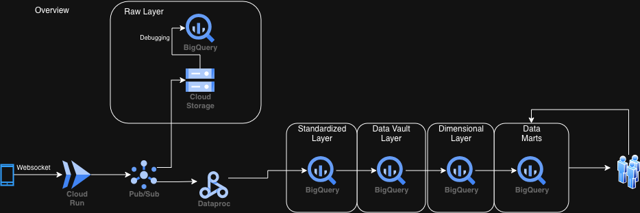

# Use case
" A company's main data source are mobile application events and backend databases. The user base is 250 million and growing by more than 50% annually. Stakeholders include data analysts
and data scientists with minimal engineering experience."

# Architecture

## Disclaimer
Before we begin, I would like to touch on the topic that several solutions might be correct or fit the use case. The assignment did a very good job explaining some needs and challenges and I understand it is unfeasible to explain all aspects of the problem on the assignment so I took some liberty to choose the solutions that I reckon will fit the best. In any case, I will also highlight bottlenecks on the proposed structure and offer alternatives that deal with them.

## High level diagram of the architecture

All of our architecture will make use of GCP products.

### Ingestion
Starting our ingestion pipeline, I chose to connect to our mobile apps by using websockets and making this data available to be consumed by using Cloud Pub/Sub. That way, whoever is interested in the data sent by the mobile applications can just subscribe to the topic and receive this data.

We to are going to subscribe to this topic. In addition, we are subscribing with two different use cases in mind: storing raw data in a storage to be used only for debugging/limited purposes and continuing our data pipeline and transformations.

Pub/Sub is a good solution for its easy of use however it can lack when it comes to customization when compared to solutions like Apache Kafka. If necessary, a solution exploring this product is possible and will function essentially the same but it can better fit the use case's limitations.

### Raw Layer
In this layer, I chose to store the raw, unstructured data that comes directly from the app into Cloud Storage. This way we can save money compared to storing it on bigquery if we smartly access the data and choose the right bucket configurations.

Of course, accessing this data might still be important so we could always import it into bigquery for further analysis and debugging but, in this use case, I am expecting that the raw data will not have a high impact as it stands and we would gain much more after some transformations.

### Standardized Layer
This layer biggest purpose is to make sure the data complies to the minimal data quality requirements. Some of them could be:

    - Deduplicating records
    - Primary key existance
    - Correct table structure

Besides that, it is basically raw layer but a bit more structured and clean. This makes this layer the main layer that everything else on our pipeline depends on and we can guarantee certain standards from it.

These transformations can easily be done with a Spark Job on Cloud Dataproc.

### Data Vault Layer
This layer is an implementation of the Data Vault modelling to our standardized data. Here, we start seeing greater structure and connections between all the data that are being sent to us. I chose this model because of how easy it is to adjust schemas and add/remove/alter tables. 

If we start consuming more data with more parameters and more columns, we can easily accomodate it with the data vault model, cutting down on time this data will reach data analysts and data scientists.

Another positive of this model structure is that we can easily see from where the data originates. What I mean is, if on our app we have different functionalities that send similar structured data, it will be very easy to drill down on the data provided by a certain functionality.

### Dimensional Layer
This layer is where we start introducing business logic. Here is where the definition of the columns that the stakeholders are interested in lives. By keeping all the definitions in one place, we can easily change it if necessary and we avoid duplication of the logic in higher layers while guaranteeing consistency.

This structure is also much simpler and more business friendly and oriented to work with than the data vault, which makes it easier for stakeholders to do their work. Besides, it is also very performant since it will not require as many joins to work in it as it would take with data vault or the more unstructured data on the layers below.

### Data Mart Layer
This is our final layer. This is where data analysts and scientists will create tables that support their needs using the definitions and structure of the previous layer. They can also create more business logic here, however it is encouraged to bring that logic inside the dimensional layer for future use.

## A bit more about the layers
All these layers and tables inside them live on BigQuery and they are defined and created using terraform. However, this does not solve the issue of making sure the tables are always being updated daily and in the right order (ie all the dependencies first). To solve this, we use Workflow and Scheduler.

With those we can easily define new tables to be created and update existing ones based on their dependencies and do this on our preferred schedule. This can be done by using SQL but if a more robust transformation is needed, we can instead attach a spark job to our workflows and proceed from there.

It is also important to consider the volume of data that 250 million users create. Partitioning and clustering through all the layers is mandatory in order to reel in the cost. Another aspect of huge importance is the creation of smart queries and/or spark jobs that will incrementally add on the existing tables and will not require a full read of them.

